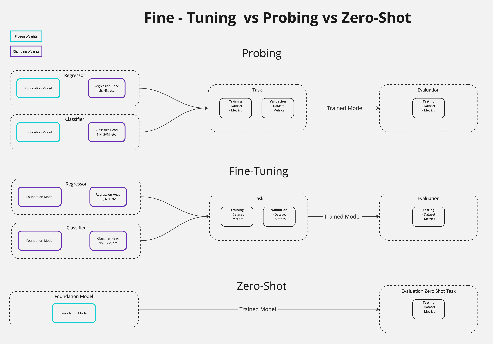
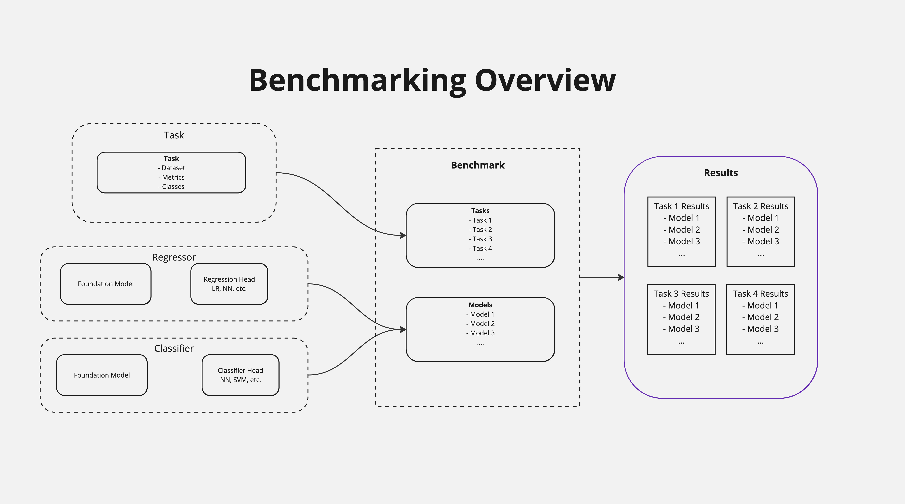

# Helical Examples

The `examples` folder contains a `run_models` and a `notebooks` folder.

## Run Models
We show that each supported Helical model can be included in a uniform manner.
```
from helical.models.scgpt.model import scGPT, scGPTConfig

scgpt_config = scGPTConfig(batch_size=10)
scgpt = scGPT(configurer = scgpt_config)
```
For specific configurations, such as `batch_size`, a model can be provided with its own configuration (`scGPTConfig` in this case).
Processing the data and getting the embeddings is uniform across models too:
```
hf_dataset = load_dataset("helical-ai/yolksac_human",split="train[:5%]", trust_remote_code=True, download_mode="reuse_cache_if_exists")
ann_data = get_anndata_from_hf_dataset(hf_dataset)
data = scgpt.process_data(ann_data)
embeddings = scgpt.get_embeddings(data)
```

## Notebooks
To do something useful with these embeddings, we provide a number of use case examples in the `notebooks` folder.

One such example is the [Cell-Type-Annotation](./notebooks/Cell-Type-Annotation.ipynb) notebook. An scGPT model is used to get embeddings of a gene expression profile which are then used as inputs to a smaller neural network, predicting the cell type.

That notebook explains the procedure step-by-step in much detail. A more modular and automated procedure can be found in the [benchmark.py](benchmark.py) script.

## Benchmark
To compare different models against each other, we built a benchmarking infrastructure. To benchmark models, we compare model performances on a dataset provided by you (or from one of our datasets). We have three choices to apply these bio foundation models:
1. By Fine-tuning a model and tweaking their weights (or additional weights )
2. By Probing a model to get the embeddings (and freezing the weights) and use these embeddings as inputs to a new classifier (which could be a Neural Network or an SVM for example).
3. Some tasks do not require any fine-tuning/learning and we can directly use the bio foundation models in a zero-shot context. 


A simple example is shown below:
```
from helical.benchmark.benchmark import Benchmark
from helical.models.scgpt.model import scGPT
from helical.models.classification.neural_network import NeuralNetwork
from helical.models.classification.classifier import Classifier
import anndata as ad
from omegaconf import DictConfig
import hydra

@hydra.main(version_base=None, config_path=".", config_name="config")
def benchmark(cfg: DictConfig) -> None:
    scgpt = scGPT()

    hf_dataset = load_dataset("helical-ai/yolksac_human",split="train[:50%]", trust_remote_code=True, download_mode="reuse_cache_if_exists")
    ann_data = get_anndata_from_hf_dataset(hf_dataset)

    train_data = ann_data[:3000]
    eval_data = ann_data[3000:3500]
    
    scgpt_nn_c = Classifier().train_classifier_head(
        train_anndata = train_data, 
        base_model = scgpt, 
        head = NeuralNetwork(**cfg["neural_network"]),
        labels_column_name = "cell_type", 
        test_size = 0.2, 
        random_state = 42)        

    bench = Benchmark()
    evaluations = bench.evaluate_classification([scgpt_nn_c], eval_data, "cell_type")
    print(evaluations)

if __name__ == "__main__":
    benchmark()
```

To make the benchmarking easier, it is also possible to use your own head, your own base model or even your own standalone classifier. We believe that researchers and practitioners should be able to test their own models against others which is why we made the framework as flexible as possible.

If you want to use your own model head, you can directly load a trained one onto your classifier:
```
saved_nn_head = NeuralNetwork().load('my_model.h5', 'classes.npy')
scgpt_loaded_nn = Classifier().load_model(scgpt, saved_nn_head, "scgpt with saved NN")    
    
saved_svm_head = SVM().load('my_svm.pkl')
scgpt_loaded_svm = Classifier().load_model(scgpt, saved_svm_head, "scgpt with saved SVM")
bench = Benchmark()
evaluations = bench.evaluate_classification([scgpt_loaded_nn, scgpt_loaded_svm], eval_data, "cell_type")
print(evaluations)
``` 
If you would like to create your own classifier head, you can have a look at the [classifier.py](../helical/models/classification/classifier.py) or [base_models.py](../helical/models/base_models.py) files where we define the protocols to be followed to make the models match and use our benchmarking function.



We use [Hydra](https://hydra.cc/) to pass configurations to our models in the [config.yaml](config.yaml) file. In this example, a neural network is used as a classification `head` but other models (such as SVM) can be found in the [classification folder](../helical/models/classification/). In order to test a classification with your own dataset and label, all you have to do is load your own anndata instance, ensure it has the correct column names/keys and specify the `lables_column_name` input variable.


We are currently developing this feature and will be adding more datasets and models soon!
